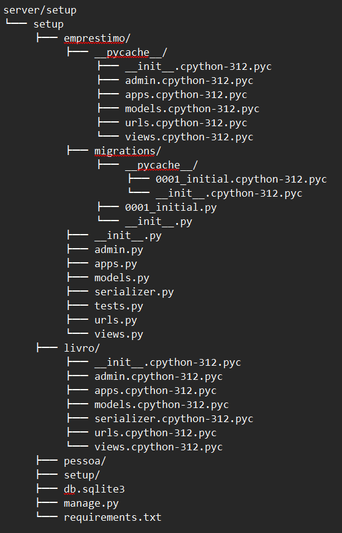

# LibraryApi

## Descrição do Projeto
API para gerenciamento de bibliotecas, desenvolvida em Django e React.

## Como baixar o repositório
1. Clone o repositório:
   
       git clone https://github.com/Dev-AndreGomes/LibraryApi.git
       cd LibraryApi

Instale as dependências:

    npm install

Pré-requisitos
-Node.js
-MySQL

Contribuindo

Consulte o arquivo CONTRIBUTING.md

Autores

-Andre Gomes
-Reinaldo Rodrigues
-Gustavo Wallace
-Kleiner Mauricio

